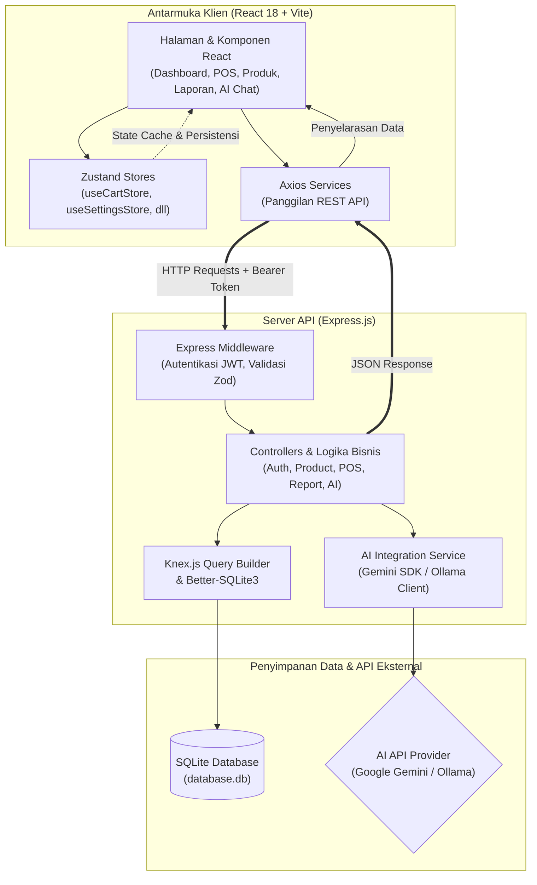

# TokoQuu — Dashboard Kasir Pintar & POS Full-Stack


TokoQuu adalah aplikasi Point of Sale (POS) dan manajemen inventaris toko berbasis full-stack. Aplikasi ini dirancang untuk membantu pemilik usaha kecil dan menengah (UMKM) mengelola transaksi harian, mengawasi stok barang secara real-time, melacak riwayat penjualan, dan menganalisis performa bisnis dengan dukungan asisten AI pintar.

---

## 🏛️ Arsitektur Sistem

Aplikasi TokoQuu dibangun menggunakan arsitektur client-server modern yang memisahkan area presentasi (Frontend), logika bisnis (Backend), dan penyimpanan data (Database/External Service).



---

## 🌟 Fitur Utama

Aplikasi TokoQuu dikemas dengan antarmuka pengguna premium yang mendukung Mode Terang dan Mode Gelap serta transisi halus untuk pengalaman pengguna yang nyaman:

### 1. Dashboard Utama & Analitik Bisnis
* **Metrik Finansial**: Ringkasan pendapatan hari ini, jumlah transaksi, rata-rata transaksi per keranjang, serta status stok produk.
* **Tren Pertumbuhan**: Perbandingan persentase performa finansial hari ini dengan hari kemarin secara otomatis.
* **Grafik Penjualan**: Visualisasi interaktif pendapatan dan volume transaksi dalam format deret waktu mingguan maupun bulanan.

### 2. Point of Sale (POS) / Kasir Digital
* **Katalog Responsif**: Daftar produk interaktif dengan saringan kategori dan kolom pencarian dinamis.
* **Pajak (PPN) & Diskon Dinamis**: Perhitungan nilai pajak (PPN %) dan diskon dihitung secara otomatis berdasarkan pengaturan global toko.
* **Multi-Metode Pembayaran**: Mendukung pembayaran tunai, transfer bank, dan QRIS.
* **Preview & Download Struk**: Cetak ulang struk belanja thermal, unduh struk belanja dalam format teks monospaced `.txt`, atau cetak langsung ke printer fisik/PDF peramban.

### 3. Manajemen Produk & Inventaris (CRUD)
* **Penyortiran Produk**: Mengurutkan produk berdasarkan Nama (A-Z, Z-A), Harga Termahal/Termurah, atau Stok Terbanyak/Tersedikit.
* **Paginasi Cerdas**: Membatasi tampilan produk sebanyak 8 produk per halaman untuk performa rendering yang lebih cepat.
* **Status Indikator Stok**: Label otomatis berkode warna untuk menandai stok produk (Normal (Hijau), Rendah (Kuning), Habis (Merah)).
* **Manajemen Stok Cepat**: Penambahan stok secara instan dengan pencatatan log perubahan.

### 4. Laporan Penjualan & Riwayat Transaksi
* **Tabel Riwayat Panjang**: Riwayat seluruh invoice penjualan yang memanjang di bagian bawah halaman laporan, terpaginasi 5 baris per halaman.
* **Filter Kalender & Status**: Pencarian transaksi menggunakan filter pencarian teks, pemilih kalender tanggal, dan status transaksi (Lunas / Batal).
* **Grafik Batang Jam Sibuk**: Grafik batang interaktif "Distribusi Transaksi Jam Sibuk" yang melacak interval jam-jam transaksi tersibuk di toko.
* **Pembatalan Transaksi (Void)**: Pembatalan invoice dengan pengembalian stok barang secara otomatis ke database.

### 5. Asisten AI Pintar (Real-time AI Chat)
* **Konteks Real-Time**: Asisten AI terintegrasi langsung dengan database SQLite toko (membaca ringkasan stok, produk terlaris, pendapatan harian).
* **AI Suggestions**: Rekomendasi pertanyaan siap-klik untuk membantu admin menganalisis data penjualan.
* **Provider AI Fleksibel**: Dapat dikonfigurasi menggunakan Google Gemini API (`gemini-2.0-flash`) atau server lokal Ollama (`llama3`).

### 6. Profil Pengguna & Kustomisasi Toko
* **Kustomisasi Tanpa Koding**: Mengubah Nama Toko, Alamat Fisik, Tarif Pajak (PPN %), dan Pesan Ucapan Struk langsung melalui panel pengaturan UI.
* **Dialog Logout Animasi**: Konfirmasi keluar sesi kasir kustom yang menawan menggunakan frosted-glass backdrop dan entrance animation (pop-in).

---

## 🛠️ Tech Stack

### Frontend (React 18)
* **Bundler & Runtime**: Vite, React 18
* **Styling**: Tailwind CSS v3 & CSS Variables (Dark/Light mode)
* **Icons**: Tabler Icons (`@tabler/icons-react`)
* **State Management**: Zustand (dengan persistence middleware untuk Settings)
* **Routing**: React Router v6
* **Charts**: Recharts
* **HTTP Client**: Axios

### Backend (Node.js & Express)
* **Server**: Express.js
* **Database**: SQLite3 via `better-sqlite3` (Koneksi sinkron berkinerja tinggi)
* **Query Builder**: Knex.js
* **Validasi**: Zod Schema Validation
* **AI Integration**: Google Generative AI (`@google/generative-ai`)
* **Security & Auth**: JSON Web Token (JWT) & bcrypt hash

---

## 📂 Struktur Folder Proyek

```
TokoQuu/
├── frontend/                    # Aplikasi React SPA (Vite)
│   ├── src/
│   │   ├── pages/               # Halaman Halaman Utama Aplikasi
│   │   ├── components/          # Komponen UI Reusable
│   │   ├── stores/              # Zustand Stores
│   │   ├── services/            # API Call Services
│   │   ├── utils/               # Formatting helper
│   │   ├── App.jsx              # Routing & Wrapper Auth
│   │   └── main.jsx
│   ├── index.html
│   ├── vite.config.js
│   ├── tailwind.config.js
│   └── package.json
│
├── backend/                     # Express REST API Server
│   ├── src/
│   │   ├── routes/              # Express API Routes
│   │   ├── controllers/         # SQL Query & Business Logic
│   │   ├── middleware/          # Security & Schema Validation
│   │   ├── db/                  # Skema SQLite & Seed Data
│   │   └── services/            # AI Integrations
│   ├── server.js                # Server Entry Point
│   ├── .env.example
│   └── package.json
│
├── database.db                  # Database SQLite (Dihasilkan otomatis)
├── .env                         # Konfigurasi Environment
├── GEMINI.md                    # Panduan Konfigurasi AI Agent
└── README.md                    # Dokumentasi utama ini
```

---

## 🚀 Instalasi & Konfigurasi

### 1. Prasyarat Sistem
Pastikan perangkat Anda sudah terinstal:
* Node.js (Versi 18 ke atas)
* NPM (Bawaan Node.js)

### 2. Pengaturan Environment Variables
Salin berkas `.env.example` di root proyek menjadi `.env`:
```bash
cp backend/.env.example .env
```
Sesuaikan konfigurasi di dalam berkas `.env`:
* **GEMINI_API_KEY**: Isi dengan API key Google AI Studio Anda jika menggunakan provider Gemini.
* **JWT_SECRET**: Masukkan string acak panjang untuk mengamankan token login.

### 3. Instalasi Dependensi
Jalankan instalasi dependensi untuk folder backend dan frontend:

**Untuk Backend:**
```bash
cd backend
npm install
```

**Untuk Frontend:**
```bash
cd ../frontend
npm install
```

### 4. Migrasi & Seed Database
Inisialisasi database SQLite dan isi data awal (dummy data) menggunakan Knex di folder `backend`:
```bash
cd ../backend
npm run db:setup
```

### 5. Menjalankan Aplikasi
Anda perlu menjalankan server backend dan server dev frontend secara bersamaan.

**Jalankan API Server (Backend):**
```bash
cd backend
npm run dev
```
*Server API akan berjalan di alamat `http://localhost:3001`*

**Jalankan Dev Server (Frontend):**
```bash
cd frontend
npm run dev
```
*Aplikasi web akan terbuka di peramban pada alamat `http://localhost:5173`*

---

## 🔑 Kredensial Login Default

Gunakan akun kasir sampel berikut untuk masuk ke dashboard pertama kali:
* **Username**: `admin`
* **Password**: `password123`

---

## 📄 Lisensi
Proyek ini dikembangkan untuk kebutuhan internal toko dan UMKM. Silakan kembangkan lebih lanjut sesuai kebutuhan bisnis Anda.
